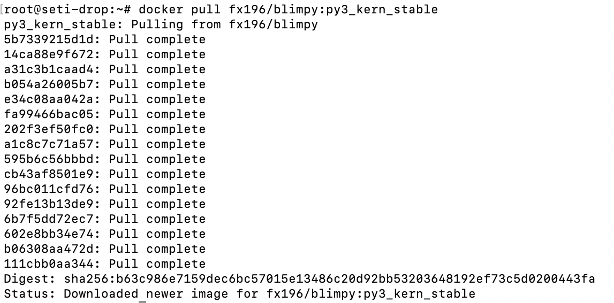

Â## Using `blimpy` with `docker`

Docker is a "containerized" service that is similar to a virtual machine. It's lighter than a virtual machine since the docker containers run directly on the host OS instead of on a guest OS.

Docker helps prevent any installation errors or problems with environment settings by building containers which are identical to the ones tested on Travis CI.

### Some Terminology

A **container** is like a remote machine with everything installed and ready to use. You can have bash sessions inside a container.

An **image** is like a blueprint or a frozen state of a system. It tells docker exactly what a container should have.


### Pulling an image
```bash
docker pull <repo>:<tag>
```

Our blimpy images are stored on docker hub, which is basically Github for docker images. *Pulling* an image downloads it to your machine.

Currently, our repo on docker hub is `fx196/blimpy`. You can specify which version of Python you want by using different tags.

For python3, use:

`docker pull fx196/blimpy:py3_kern_stable`

For python2, use:

`docker pull fx196/blimpy:py2_kern_stable`



### Run container from image

```bash
docker run --name <name> -it <repo>:<tag> bash
```

This command takes the image `<repo>:<tag>`, builds a container from it, and opens an interactive bash session inside it.

For example:

`docker run --name dratini -it fx196/blimpy:py3_kern_stable bash`

Will build a container with the python3 version of blimpy that's named `dratini` and connect to it. Think of this as starting up your remote machine and then `ssh`-ing to it.

Exit the container after running it with ctrl+P then ctrl+Q.

### TLDR

- `docker pull fx196/blimpy:py3_kern_stable` to pull python3 version image
- `docker run --name blimpy_py3 -it fx196/blimpy:py3_kern_stable bash` to start container
- ctrl+P then ctrl+Q to exit container

### After running the container

Continuing to treat our container as a remote machine:

| Remote Machine Command | Docker equivalent | Use | Example |
| ----- | ----- | ----- | ----- |
| exit | ctrl+P then ctrl+Q | disconnect from machine | |
| ssh | docker attach \<name\> | connect to machine | `docker attach dratini`|
| `scp local_file remote:remote_path` | `docker cp local_file name:container_path`| copy from local to remote | `docker cp test.fil dratini:/data`|
| `scp remote:remote_file local_path` | `docker cp name:container_path local_path` | copy from remote to local | `docker cp dratini:/data/test.fil .`
